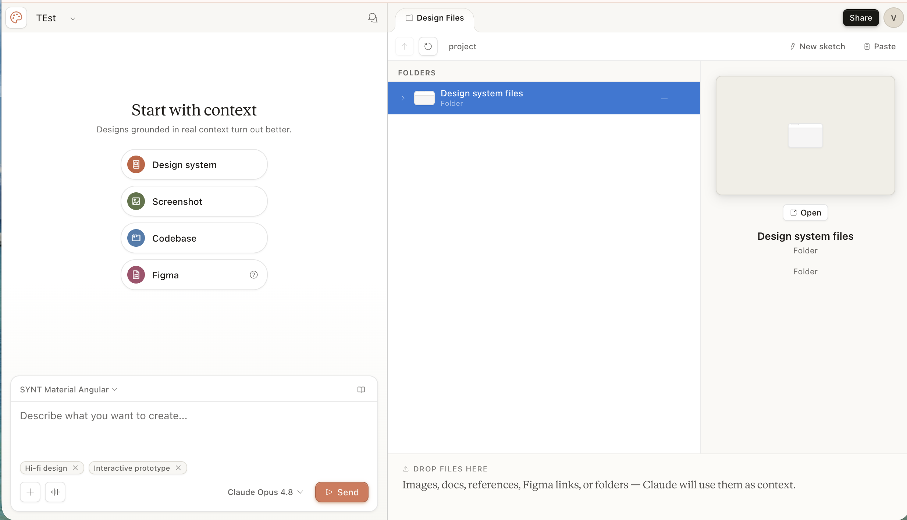
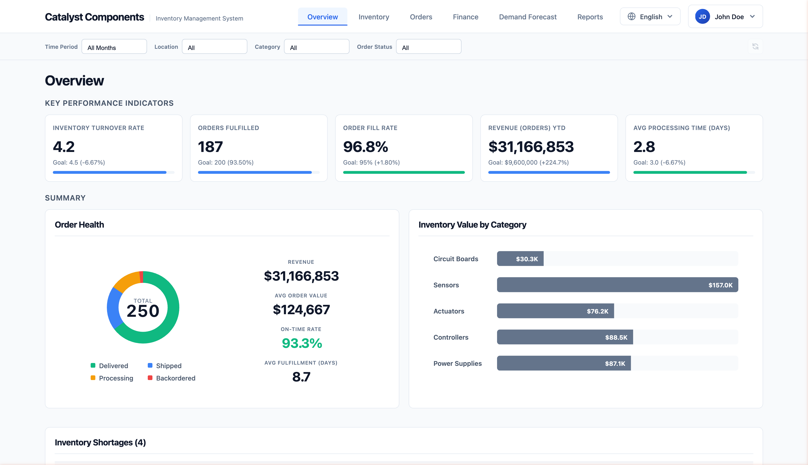
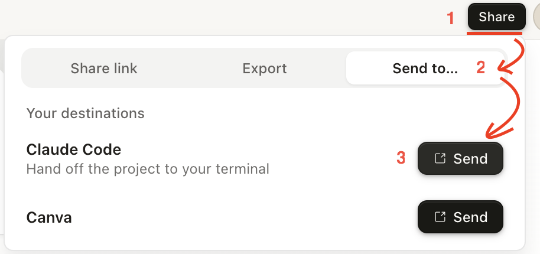
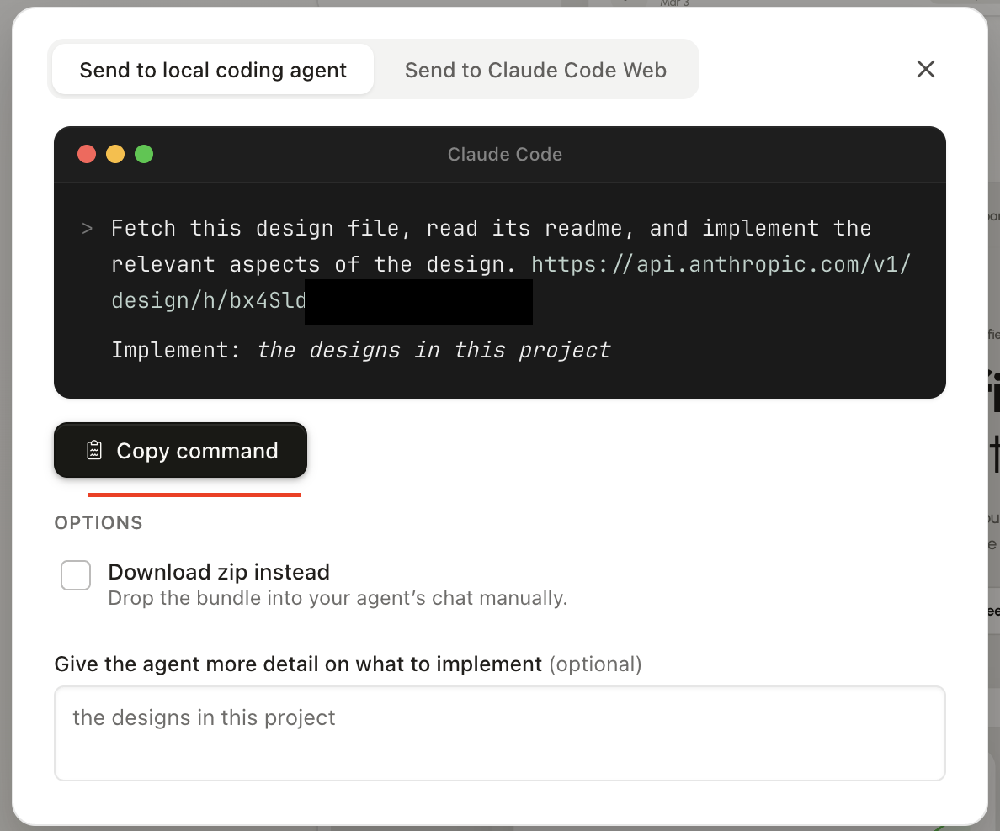
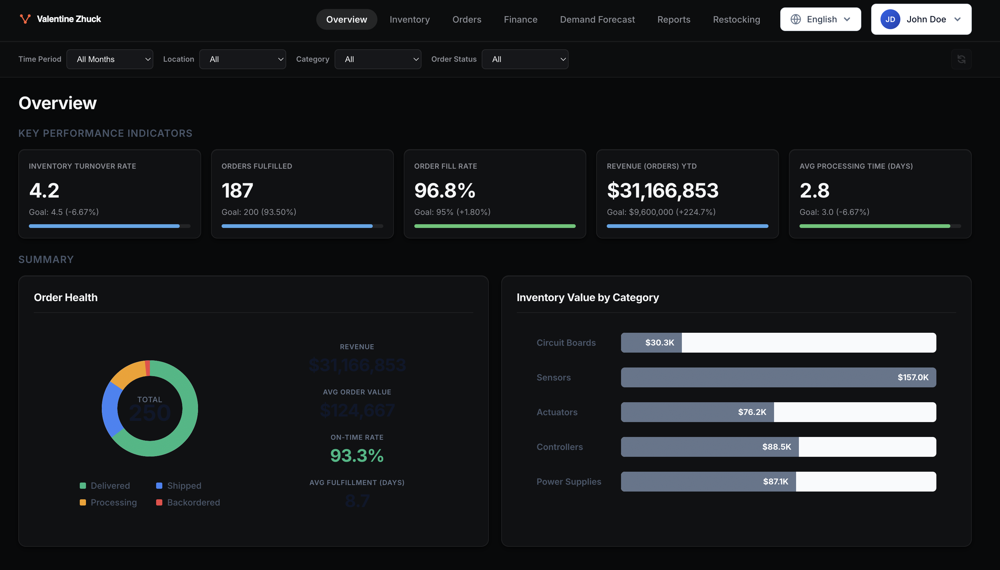

# Claude Design In Action


## Step 1. Introduction in Desing System
lets interact with Claude code . The experience you have already had with chat GPT, etc.

### Ask Claude what design system is
**Goal:** Identify and name design system layers in reference, you are going to create.

**Prompt:**
> "What are the core components of a design system?"

<details>
<summary> Example of Claude output: </summary>

    ```
    A design system typically consists of:

    1. Design Tokens — the atomic values everything is built from:
    - Color palette (primary, secondary, semantic: success/error/warning)
    - Typography scale (font families, sizes, weights, line heights)
    - Spacing scale (4px / 8px grid systems, margin/padding values)
    - Border radii, shadows, z-index levels

    2. Core Components — reusable UI building blocks:
    - Buttons (primary, secondary, ghost, destructive)
    - Form elements (inputs, checkboxes, selects)
    - Cards, modals, tooltips, badges
    - Navigation patterns (navbar, sidebar, breadcrumbs)

    3. Layout Patterns — how components are arranged:
    - Grid system, breakpoints
    - Page templates and section structures

    4. Documentation — the rules for usage:
    - When to use each component
    - Dos and don'ts
    - Accessibility guidelines

    Without design tokens, components have no shared vocabulary. Without components,
    you rebuild the same UI from scratch every time.

    ```
</details>


## Step 2. Claude Design: Design System Creation 

> [!IMPORTANT]
> 1. To proceed with practical task below you need to have Enterprise license (alternatively personal Claude Pro +)  
> 2. If you choose "Create Design System" option your flow will be slightly different

Now we know what design sytem is. Let's use claude design to build a Design System from a reference website or your company brand guidelines. 
**Expected result**: Claude generate a complete design system — tokens, components, and a test page — entirely through prompting. No manual CSS extraction or token spreadsheets.

**Reference you can use:
- **stripe.com** (clean, well-documented design — good for learning)
- your company/client artifacts (Figma, website, etc.)

 
1. Open [https://claude.ai/design](https://claude.ai/design)  & login 
2. GO to "Prototype" -> "New Prototype"
   - Project name: enter name your your dsign system
   - Design System: none
   - High Fidelity  
3. Press Create -> you should see New prototype window 

4. Add promt & details to generate your design system based on reference desing   
> You can use EPAM artifacts (https://elements.epam.com/), your customer website ot any Figma file you have. Alternatively use https://stripe.com/ website as a reference for your design
   - Add promt to ask claude design to create new design system based on your usecase
    > NOTE: you can use claude chat to expand your promt for Claude design, which should give a bit better result
   - Add references into context (depending what you have): screenshots, figma files, your photo etc.
   - Press send to start the process
5. Once finished, review design system artifacts and provide feedback to fine tune them
   > NOTE. Often Claude generate inedex.html, so you can check how your landing page may look like   
6. Congrats you have your Design System!


This hands-on lab has basic level tasks to get started working with Claude Code. The lab is built on top of [Inventory Management @VZhuck repo](https://github.com/VZhuck/inventory-management) repository.

## Step 3. Intermidiate check list
> [!IMPORTANT] Ensure you have stable dev env for next task


- [ ] [Inventory Management repo](https://github.com/VZhuck/inventory-management) code is avaialble on local machine
- [ ] Back-end API is up & running  [http://localhost:8001/](http://localhost:8001/)
- [ ] Front-end App is up & running [http://localhost:3000/](http://localhost:3000/)
- [ ] UI App connected to back-end, showing test data 
 
- [ ] You have your style system, you've created on Step 2

## Step 4. Adopt Your Design System

### Step 4.1. Connect Design System to claude code 
1. Go to "https://claude.ai/design" -> "Your designs"(or choose existing via "Design Systems")-> select design system you want to use
2.  Then "Share" it with Claude Code

3. Copy command and switch back to Inventory Management repo


### Step 4.2. Apply New Design System to 'Inventory Management' 
1. Open Inventory Management repository in VS Code or console
2. Update exported Design System prompt (step 3.1.3) 
3. Re-iterate with Claude Code until you get a satisfactory result   
4. Verify result. For example:

>PS. Note bad for a signle prompt with 1 follow up fix?! 

### Step 4.3. Reflection on Results
1. Create PR to main & inspect changes
2. Are the changes aligned with code quality expectations? If not, what can be improved?
3. With which use cases might such an approach work? 
