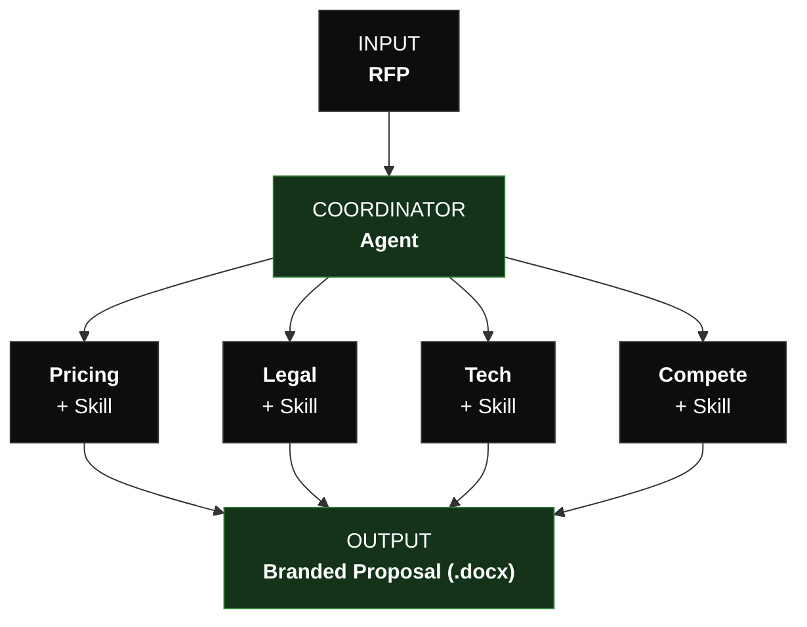

# Task 09 — Claude Code RFP Agent

## Overview

```text
root/
├── index.md                          # Task description / entry point
│
├── .claude/
│   ├── settings.json                 # Project-level Claude Code settings (enable Dynamyc Workflows, for example)
│   ├── settings.local.json           # Local overrides (gitignored)
│   │
│   ├── agents/                       # RFP sub-agent definitions
│   │   ├── deal-desk-orchestrator.md # Orchestrator agent (coordinates others)
│   │   ├── competitive.md            # Competitive intelligence agent
│   │   ├── legal.md                  # Legal review agent
│   │   ├── pricing.md                # Pricing strategy agent
│   │   ├── risk-assessment.md        # Risk assessment agent
│   │   └── technical-fit.md          # Technical fit evaluation agent
│   │
│   └── skills/                       # Reusable skill definitions
│       ├── competitive-intel/SKILL.md
│       ├── docx/SKILL.md             # DOCX output generation
│       ├── legal-checklist/SKILL.md
│       ├── pricing-playbook/SKILL.md
│       └── risk-assessment/SKILL.md
│
├── synthetic-data/                   # Sample input data for testing
│   ├── rfp-acme-corp.md              # Sample RFP document
│   ├── past-wins.json                # Historical win/loss data
│   └── product-overview.md          # Product reference material
│
└── outputs/                          # Generated agent outputs & final reslts will be in this folder (empty/gitkeep)
    └── .gitkeep
```

## Task A: Agents in Claude Code 

### Step 1. Ask claude code to process RFP 
> [!IMPORTANT]
> Run each approache below in separate session, so you can compare token usage & costs. 

Ask caude to process RFP in thre different way:
1. do NOT specify any subagent strategy - most likely clauyde will run single agent and use skills
2. Specify `agent teams` in your promt, so that claude run you request as team of agents. You may need to be quite specific which agents to include in the team
3. Specify `Dynamic Workflow` in your promt

### Step 2. Compare results
> [!IMPORTANT]
> To make sure you files are not overriden, please store them on different folder

1. Compare output quality (My suggestion to look closer to Risk Assessment report)
2. Compare costs

### Step 3. Implement flow as using AgentSDK
Implement suggested flow as Anthrpic AgentSDK

### Prompt Example  

```
I need to process an RFP, spin up an agent team where a coordinator will distribute tasks,
other specialized agents will pick up work and proceed with the task.
Agents can communicate with each other.
```

## Task B: Agent SDK
Migrate provided RFP to Agent SDK & run it as a Swarm Agent (see diagram delow)



## Task C: Innovate (optional)
Implement your own idea how to enriach this flow or provide better user experience.
The goal is to have hands experience with Claude Code & Agent SDK  


